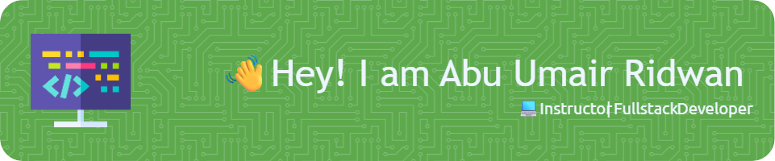

<!-- ## Hi there 👋 -->

<!--
**abu-umair/abu-umair** is a ✨ _special_ ✨ repository because its `README.md` (this file) appears on your GitHub profile.

Here are some ideas to get you started:

- 🔭 I’m currently working on ...
- 🌱 I’m currently learning ...
- 👯 I’m looking to collaborate on ...
- 🤔 I’m looking for help with ...
- 💬 Ask me about ...
- 📫 How to reach me: ...
- 😄 Pronouns: ...
- ⚡ Fun fact: ...
-->

<!-- <h1 align="left">👋 Assalamu'alaikum, saya Abu Umair Ridwan</h1> -->

###

<h2 align="left">About me</h2>

###

Saat ini saya: 📌 🧑‍🏫 Mengajar **bahasa pemrograman** di sebuah pondok pesantren 📌 🧑‍💻 Bekerja sebagai **Fullstack Web Developer** di sebuah perusahaan

###

<h2 align="left">I code with</h2>

###

  
  
  
  
  
  
  
  
  
  
  
  
  
  
  
  
  
  
  
  
  
  
  

###
##### My Github Stats

##### Connect with me
   

****
<h2 align="left">Play game with me</h2>

###

<picture>
  <source media="(prefers-color-scheme: dark)" srcset="https://raw.githubusercontent.com/abu-umair/abu-umair/output/pacman-contribution-graph-dark.svg">
  <source media="(prefers-color-scheme: light)" srcset="https://raw.githubusercontent.com/abu-umair/abu-umair/output/pacman-contribution-graph.svg">
  
</picture>

###